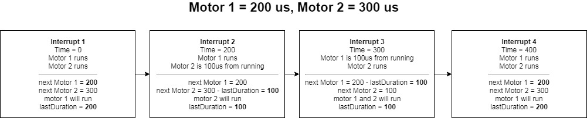

# VDW_Stepper

### The problem

Other stepper libraries require you to poll a `run()` or `step()` function to move the motor.  At low motor speeds or in programs where other processes are limited, this works okay, but you end up calling the `run()` or `step()` function much more frequently than required.

At higher motor speeds, it becomes necessary to call the `run()` or `step()` function from a timer-based interrupt, however, in order to accommodate a range of motor speeds, a very short timer duration is required, often 20 us or less. This again leads to calling the `run()` or `step()` function far more than necessary. For example, for a **4000 step/sec** motor (quick but not fast), a step only needs to be issued every **250 us**. If we pick a **20 us** update interval, the stepper will be called **10 us** late every other step, a **4% error!** or as if it was running at **3846 steps/sec**. Because most motors vary in speed, it is difficult if not impossible to pick the ideal update interval.

### The Solution

What if the stepper library new how when the next step was required and called the `run()` function on it's own? Stepper libraries that have speed control already calculate when the next step is due. All it needs to do is set a timer-interrupt to fire right when it's needed.  That means for any given `step/sec` target speed, the controller can send it's pulse on-time to within a micro-second! With the previous example of a **4000 step/sec** motor, the error is reduced to **.4%** in the worst case scenario AND the update function is only called when needed.  In the previous example, with a **20 us** update rate the `run()` function was called **13 times** for one step!

Enter VDW_Stepper.  `VDW_Stepper` leverages the powerful `SparkIntervalTimer` library to manage timer-interrupt calls and sets the interval according to every steps needs.  Multiple stepper motors can even be run at the same time, using the same interrupt!

## Usage

Connect a stepper driver, add the VDW_Stepper library to your project and follow this simple example:

```
#include "VDW_Stepper.h"
const pin_t step_pin = D0;
const pin_t direction_pin = D1;

VDW_Stepper myStepper(step_pin,direction_pin);

void setup() {
  myStepper.setSpeed();
  myStepper.run();
}

void loop() {
}
```

See the [examples](examples) folder for more details.

## Documentation

### Interrupt Sharing

`VDW_Stepper` shares a single interrupt for multiple motors.  To minimize the compute cycles of the interrupt, a wrapper class is built around `SparkIntervalTimer` that contains helper data preventing unnecessary function calls

```cpp
struct TimerData{
	bool nextToRun[255];
	uint16_t lastDuration;
	uint8_t numSteppers;
};
```
An example of how 2 motors might share the interrupt timer:



### API

###### MotorInterfaceType (enum)
Symbolic names for number of pins.Use this in the pins argument the AccelStepper constructor to provide a symbolic name for the number of pins to use.
* FUNCTION
* DRIVER
* FULL2WIRE
* FULL3WIRE
* FULL4WIRE
* HALF3WIRE
* HALF4WIRE

###### Constructor
You can have multiple simultaneous steppers, all moving at different speeds and accelerations, provided you call their run() functions at frequent enough intervals. Current Position is set to 0, target position is set to 0. MaxSpeed and Acceleration default to 1.0. The motor pins will be initialised to OUTPUT mode during the constructor by a call to enableOutputs().
**Parameters**
* *Interface* - Number of pins to interface to. 1, 2, 4 or 8 are supported, but it is preferred to use the MotorInterfaceType symbolic names. Defaults to DRIVER (2) pins.
* *pin1* - Pin number for motor pin 1. Defaults to D2. For a DRIVER interface, this is the Step input to the driver. Low to high transition means to step
* *pin2* - Pin number for motor pin 2. Defaults to D3. For a DRIVER interface, this is the Direction input to the driver. High means clockwise.
* *pin3* - Pin number for motor pin 3. Defaults to pin 4.
* *pin4* - Pin number for motor pin 4. Defaults to pin 5.
* *enable* If this is true (the default), enableOutputs() will be called to enable the output pins at construction time.

###### Alternate Constructor
Will call your own functions for clockwise and counterClockwise steps. You can have multiple simultaneous steppers, all moving at different speeds and accelerations, provided you call their run() functions at frequent enough intervals. Current Position is set to 0, target position is set to 0. MaxSpeed and Acceleration default to 1.0. Any motor initialization should happen before hand, no pins are used or initialized.
**Parameters**
* *clockwise* -  void-returning procedure that will make a clockwise step
* *counterClockwise* - void-returning procedure that will make a counterClockwise step

## Contributing

Here's how you can make changes to this library and eventually contribute those changes back.

To get started, [clone the library from GitHub to your local machine](https://help.github.com/articles/cloning-a-repository/).

Change the name of the library in `library.properties` to something different. You can add your name at then end.

Modify the sources in <src> and <examples> with the new behavior.

To compile an example, use `particle compile examples/usage` command in [Particle CLI](https://docs.particle.io/guide/tools-and-features/cli#update-your-device-remotely) or use our [Desktop IDE](https://docs.particle.io/guide/tools-and-features/dev/#compiling-code).

After your changes are done you can upload them with `particle library upload` or `Upload` command in the IDE. This will create a private (only visible by you) library that you can use in other projects. Do `particle library add VDW_Stepper_myname` to add the library to a project on your machine or add the VDW_Stepper_myname library to a project on the Web IDE or Desktop IDE.

At this point, you can create a [GitHub pull request](https://help.github.com/articles/about-pull-requests/) with your changes to the original library. 

If you wish to make your library public, use `particle library publish` or `Publish` command.

## LICENSE
Copyright 2018 Ben Veenema

Licensed under the MIT license
